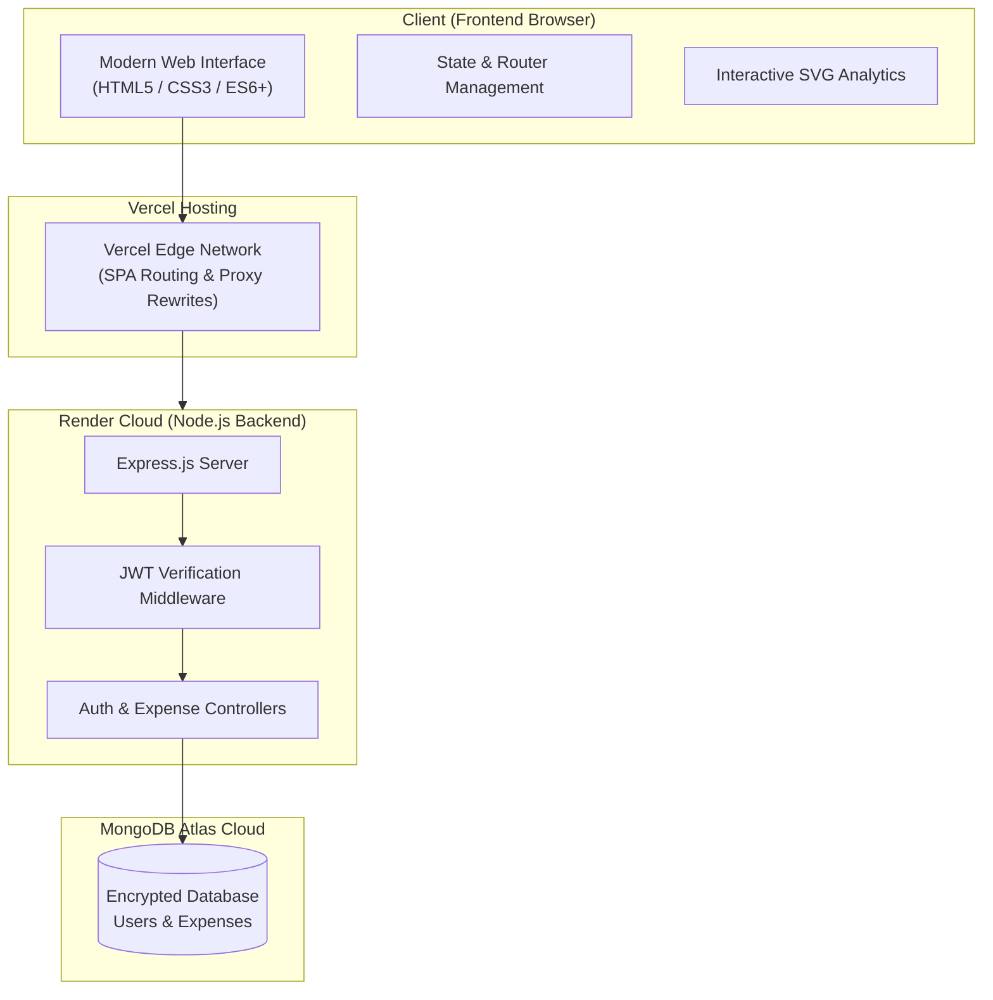

# 💰 Smart Financial Intelligence — Expense Tracker

[](https://vitejs.dev/)
[](https://developer.mozilla.org/en-US/docs/Web/JavaScript)
[](https://nodejs.org/)
[](https://expressjs.com/)
[](https://www.mongodb.com/)
[](https://jwt.io/)
[](https://vercel.com/)
[](https://render.com/)

> **A smart, modern, and privacy-focused personal finance manager.** Designed for everyday individuals, freelancers, and teams who want to take control of their daily spending, avoid overspending, and visualize their financial health with zero hassle.

---

## 🌐 Live Application Links

| Service | Link | Status |
| :--- | :--- | :---: |
| 🖥️ **Web Application (Vercel)** | [expense-tracker-alpha-lemon-24.vercel.app](https://expense-tracker-alpha-lemon-24.vercel.app) | 🟢 Live |
| ⚙️ **Backend API (Render)** | [expensetracker-ragq.onrender.com](https://expensetracker-ragq.onrender.com) | 🟢 Operational |

---

## 🌟 Table of Contents

- [💡 What is Expense Tracker?](#-what-is-expense-tracker)
- [🎯 Why Use This App? (Key Benefits)](#-why-use-this-app-key-benefits)
- [🧭 How It Works in 3 Simple Steps](#-how-it-works-in-3-simple-steps)
- [✨ Core Features](#-core-features)
- [🎨 Dynamic Themes](#-dynamic-themes)
- [🏗️ System Architecture](#️-system-architecture)
- [🛠️ Tech Stack & Why We Chose It](#️-tech-stack--why-we-chose-it)
- [📡 API Reference](#-api-reference)
- [💻 Local Setup Guide (For Developers)](#-local-setup-guide-for-developers)
- [🚢 Cloud Deployment Guide](#-cloud-deployment-guide)
- [🔒 Security & Data Privacy](#-security--data-privacy)
- [❓ Frequently Asked Questions (FAQ)](#-frequently-asked-questions-faq)
- [📄 License](#-license)

---

## 💡 What is Expense Tracker?

**Expense Tracker** is a personal finance tool built to eliminate the stress of managing daily money. 

Instead of dealing with complicated spreadsheets or confusing banking apps, **Expense Tracker** provides a clean, visual, and private dashboard where you can:
1. Log every expense in seconds.
2. Set monthly spending targets and get warned before exceeding them.
3. Understand exactly where your money goes through automated charts and category breakdowns.

---

## 🎯 Why Use This App? (Key Benefits)

| Benefit | Description |
| :--- | :--- |
| 🛡️ **Total Financial Privacy** | Your data belongs only to you. Every account is encrypted and isolated with bank-grade password security. |
| 🚨 **Never Overspend Again** | Set a monthly budget goal (e.g., $1,000/month). The app automatically calculates your remaining balance and visually warns you if you get close to the limit. |
| 📊 **Clarity at a Glance** | Colorful, interactive charts show your exact spending percentage across groceries, travel, bills, dining out, and more. |
| 📥 **Export to Excel / CSV** | Need to file taxes or share reports with an accountant? Download all your transaction history with a single click. |
| 📱 **Works on Any Device** | Beautiful, responsive design optimized for mobile phones, tablets, laptops, and desktop monitors. |
| 🎨 **Eye-Friendly Themes** | Choose between 4 professionally tuned color palettes to suit your mood and lighting conditions. |

---

## 🧭 How It Works in 3 Simple Steps


1. **Create Your Private Account:** Sign up with your name and email, then optionally customize your monthly budget goal.
2. **Log Your Expenses:** Whenever you buy something, add the amount, category (e.g., Food, Travel), date, and a quick note.
3. **Watch Your Savings Grow:** Review real-time analytics, spot unnecessary expenses, and keep your budget in the green zone.

---

## ✨ Core Features

### 👤 1. Account & Security Management
- **Instant Signup & Login:** Secure authentication with encrypted passwords and persistent sessions.
- **Personal Profile Customizer:** Change your display name and update your monthly budget anytime.

### 💳 2. Transaction Tracking (Full CRUD)
- **Add Expense:** Quick modal with pre-defined categories (🍔 Food & Drinks, 🚗 Travel & Fuel, 💡 Bills & Utilities, 🛍️ Shopping, 🏥 Health, 🎬 Entertainment, 📦 Other).
- **Edit & Update:** Made a typo? Click any transaction to modify amounts or notes instantly.
- **Delete:** Remove accidental or cancelled transactions with one-click confirmation.
- **Filter & Search:** Instantly locate any expense by typing a keyword or filtering by category and date.

### 📈 3. Visual Analytics & Budget Meter
- **Budget Health Indicator:** A live progress bar that adapts dynamically:
  - 🟢 **Safe Zone (0% - 70% spent):** You are well within your budget.
  - 🟡 **Warning Zone (70% - 99% spent):** Approaching your monthly limit.
  - 🔴 **Exceeded (100%+ spent):** Alerts you immediately that you have gone over budget.
- **Category Spending Breakdown:** Interactive charts showing proportions of your spending.
- **Key Metrics:** Fast summary cards for **Total Spent**, **Total Transactions**, **Remaining Budget**, and **Average Expense**.

### 📄 4. One-Click CSV Export
- Export your entire transaction history to a standard `.csv` spreadsheet file with formatted headers, timestamps, and categories.

---

## 🎨 Dynamic Themes

Switch themes in real-time using the theme picker in the top right corner:

| Theme Name | Style / Atmosphere | Preview Palette |
| :--- | :--- | :--- |
| 🌙 **Night Owl** | Sleek modern dark mode with purple & indigo glows | `Slate Dark` + `Vibrant Violet` |
| 🌿 **Forest Emerald** | Calming organic dark palette with mint accents | `Deep Pine` + `Fresh Mint` |
| 💎 **Ocean Sapphire** | High-tech cyber-marine look with cyan highlights | `Midnight Navy` + `Electric Cyan` |
| 🌅 **Sunset Amber** | Warm twilight ambiance with amber & rose tones | `Warm Charcoal` + `Sunset Amber` |

---

## 🏗️ System Architecture



---

## 🛠️ Tech Stack & Why We Chose It

### Frontend
- **Vanilla JavaScript (ES6+ Modules):** Ultra-fast, zero bulky dependencies, and guarantees silky-smooth 60fps animations.
- **Vite:** Next-generation build tool providing near-instant development updates and optimized production bundles.
- **Custom CSS Design System:** Crafted with glassmorphism, responsive grid layouts, and custom CSS variables for effortless theme switching.

### Backend
- **Node.js & Express 5:** High-throughput, lightweight runtime for handling RESTful API requests with low latency.
- **MongoDB & Mongoose:** Scalable cloud document database for storing user profiles and financial records.
- **JSON Web Tokens (JWT) & bcryptjs:** Industry-standard security for token-based authentication and salted password hashing.

---

## 📁 Project Directory Structure

```text
ExpenseTracker/
├── backend/                      # Node.js + Express API
│   ├── config/
│   │   └── db.js                 # MongoDB database connection
│   ├── controllers/
│   │   ├── authController.js     # User registration, login, and profile logic
│   │   └── expenseController.js  # Expense CRUD business logic
│   ├── middleware/
│   │   ├── authMiddleware.js     # Protected route validation with JWT
│   │   └── errorMiddleware.js    # Centralized error handler
│   ├── models/
│   │   ├── Expense.js            # Expense data schema
│   │   └── User.js               # User data schema
│   ├── routes/
│   │   ├── authRoutes.js         # /api/auth endpoints
│   │   └── expenseRoutes.js      # /api/expenses endpoints
│   ├── .env                      # Secret keys and database URI
│   ├── package.json
│   └── server.js                 # Main server entrypoint
│
├── frontend/                     # Modern Web Client (Vite)
│   ├── public/                   # Favicons and static assets
│   ├── src/
│   │   ├── components/           # Reusable UI modules (Modals, Charts, Sidebars)
│   │   │   ├── AuthHero.js
│   │   │   ├── BudgetModal.js
│   │   │   ├── BudgetWidget.js
│   │   │   ├── CategoryFilters.js
│   │   │   ├── ExpenseModal.js
│   │   │   ├── ExpenseTable.js
│   │   │   ├── Sidebar.js
│   │   │   ├── StatsRow.js
│   │   │   ├── ThemePicker.js
│   │   │   ├── Topbar.js
│   │   │   └── VisualAnalytics.js
│   │   ├── utils/                # Helpers (Toasts, Date Formatting, CSV Export)
│   │   ├── views/                # Full pages (Login, Register, Dashboard)
│   │   ├── api.js                # Centralized network request handler
│   │   ├── main.js               # Application router & lifecycle
│   │   └── style.css             # Unified CSS design system and themes
│   ├── .env.development          # Local development configuration
│   ├── .env.production           # Production API base URL
│   ├── index.html                # App entry HTML document
│   ├── package.json
│   ├── vercel.json               # Vercel proxy & SPA route rewrites
│   └── vite.config.js            # Vite configuration
│
└── README.md                     # Project documentation
```

---

## 📡 API Reference

### 🔐 Authentication (`/api/auth`)

| Method | Endpoint | Description | Requires Login? |
| :--- | :--- | :--- | :---: |
| `POST` | `/api/auth/register` | Register a new user | ❌ No |
| `POST` | `/api/auth/login` | Log in and receive JWT token | ❌ No |
| `GET` | `/api/auth/profile` | Get current user's profile and budget | ✅ Yes |
| `PUT` | `/api/auth/profile` | Update profile information or monthly budget | ✅ Yes |

### 💳 Expense Operations (`/api/expenses`)

| Method | Endpoint | Description | Requires Login? |
| :--- | :--- | :--- | :---: |
| `GET` | `/api/expenses` | Fetch all expenses for the logged-in user | ✅ Yes |
| `POST` | `/api/expenses` | Add a new expense record | ✅ Yes |
| `PUT` | `/api/expenses/:id` | Update an existing expense by ID | ✅ Yes |
| `DELETE` | `/api/expenses/:id` | Delete an expense record by ID | ✅ Yes |

---

## 💻 Local Setup Guide (For Developers)

Follow these instructions to run the project on your local computer:

### 1. Prerequisites
- **Node.js:** v18.0.0 or higher ([Download Node.js](https://nodejs.org/))
- **MongoDB:** A free [MongoDB Atlas Cluster](https://www.mongodb.com/atlas) or a local MongoDB server.
- **Git:** Installed on your computer.

### 2. Clone the Repository
```bash
git clone https://github.com/ayushi-309/ExpenseTracker.git
cd ExpenseTracker
```

### 3. Configure & Start Backend
1. Open a terminal and navigate to `backend`:
   ```bash
   cd backend
   npm install
   ```
2. Create a `.env` file in the `backend/` folder:
   ```env
   PORT=5000
   MONGO_URI=mongodb+srv://<username>:<password>@cluster0.mongodb.net/expensetracker?retryWrites=true&w=majority
   JWT_SECRET=your_custom_jwt_secret_key
   ```
3. Start the backend server:
   ```bash
   npm run dev
   ```
   *Your backend is now running at `http://localhost:5000`.*

### 4. Configure & Start Frontend
1. Open a **second** terminal window and navigate to `frontend`:
   ```bash
   cd frontend
   npm install
   ```
2. Start the Vite dev server:
   ```bash
   npm run dev
   ```
3. Open your browser and navigate to the displayed URL (usually `http://localhost:3000` or `http://localhost:5173`).

---

## 🚢 Cloud Deployment Guide

### Deploying the Backend on Render
1. Create a new **Web Service** on [Render](https://render.com/).
2. Link your GitHub repository and set **Root Directory** to `backend`.
3. Set **Build Command** to `npm install` and **Start Command** to `node server.js`.
4. In **Environment Variables**, add:
   - `MONGO_URI` (your MongoDB connection string)
   - `JWT_SECRET` (your secret encryption key)
   - `NODE_ENV=production`

### Deploying the Frontend on Vercel
1. Go to [Vercel](https://vercel.com/) and click **Add New Project**.
2. Select your repository and set the **Root Directory** to `frontend`.
3. The included `vercel.json` will automatically configure API proxy rewrites and SPA fallback routing:
   ```json
   {
     "rewrites": [
       {
         "source": "/api/:match*",
         "destination": "https://expensetracker-ragq.onrender.com/api/:match*"
       },
       {
         "source": "/(.*)",
         "destination": "/"
       }
     ]
   }
   ```
4. Click **Deploy**. Your app will be live within seconds!

---

## 🔒 Security & Data Privacy

- 🔑 **Encrypted Credentials:** Passwords are mathematically hashed with random salt rounds using `bcryptjs` before reaching the database.
- 🛡️ **JWT Session Protection:** All sensitive operations require a verified JSON Web Token passed in the `Authorization: Bearer` header.
- 🔒 **User Isolation:** All database read/write queries are strictly scoped to the authenticated user ID (`req.user.id`). No user can view or alter another user's financial records.
- 🌐 **CORS Protection:** Cross-Origin Resource Sharing is controlled to ensure safe client-to-server communication.

---

## ❓ Frequently Asked Questions (FAQ)

<details>
<summary><b>1. Is my financial data visible to other users?</b></summary>
<br/>
No. Every user account has an isolated data partition. When you log in, your private security token ensures that you only have access to your own expenses and budget information.
</details>

<details>
<summary><b>2. How do I change my monthly budget?</b></summary>
<br/>
Click on your avatar/name or the <b>"Edit Budget"</b> button on the dashboard. Enter your new target monthly amount and save. Your visual progress bar and health alerts will update instantly.
</details>

<details>
<summary><b>3. Can I export my expenses for tax or accounting purposes?</b></summary>
<br/>
Yes! On the dashboard, click the <b>"Export CSV"</b> button. A standard CSV file will immediately download to your computer, which you can open with Microsoft Excel, Google Sheets, or Apple Numbers.
</details>

<details>
<summary><b>4. Does the app work offline?</b></summary>
<br/>
The web app caches interface assets for fast loading. However, an internet connection is required to sync and save your transactions securely to the cloud database.
</details>

---

## 📄 License

This project is licensed under the [ISC License](LICENSE) — feel free to use and adapt it for personal or educational purposes.
